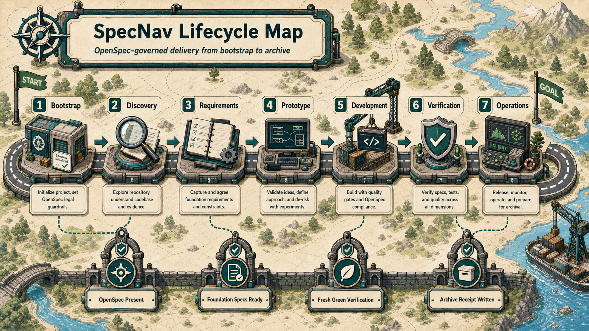
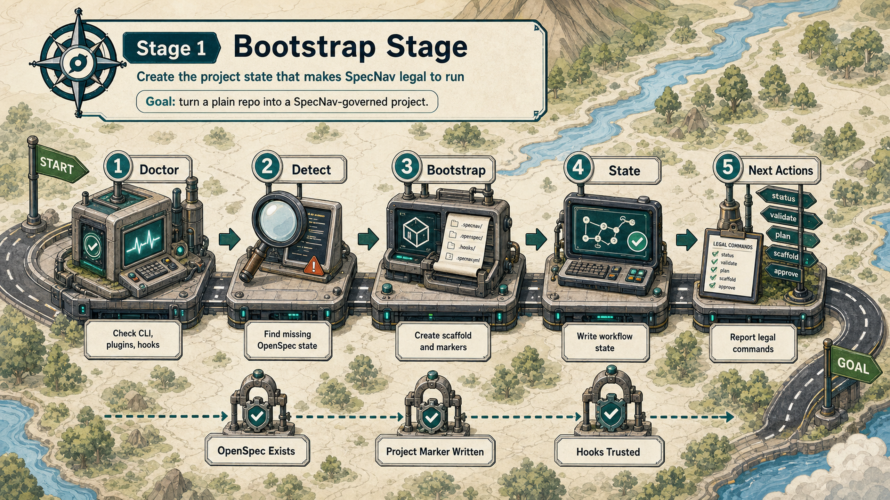
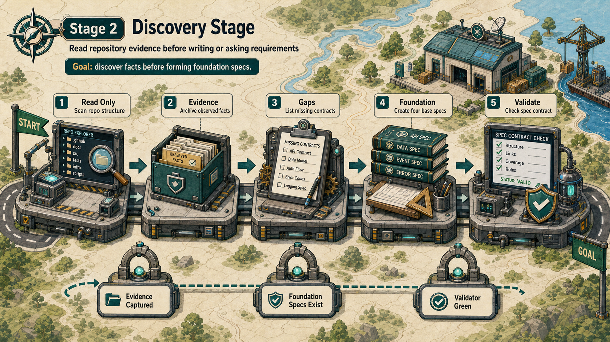
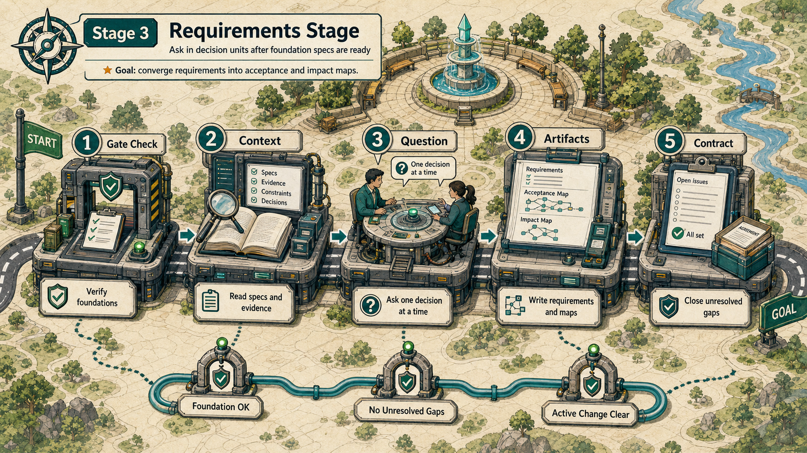
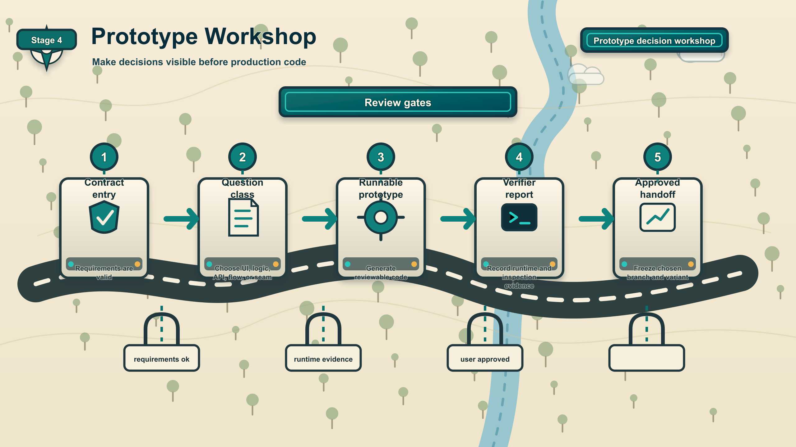
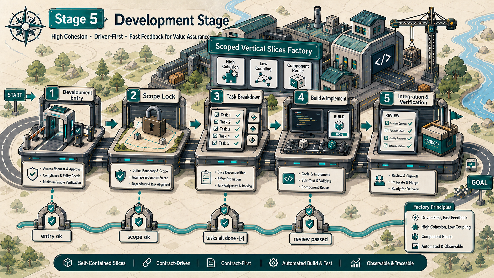
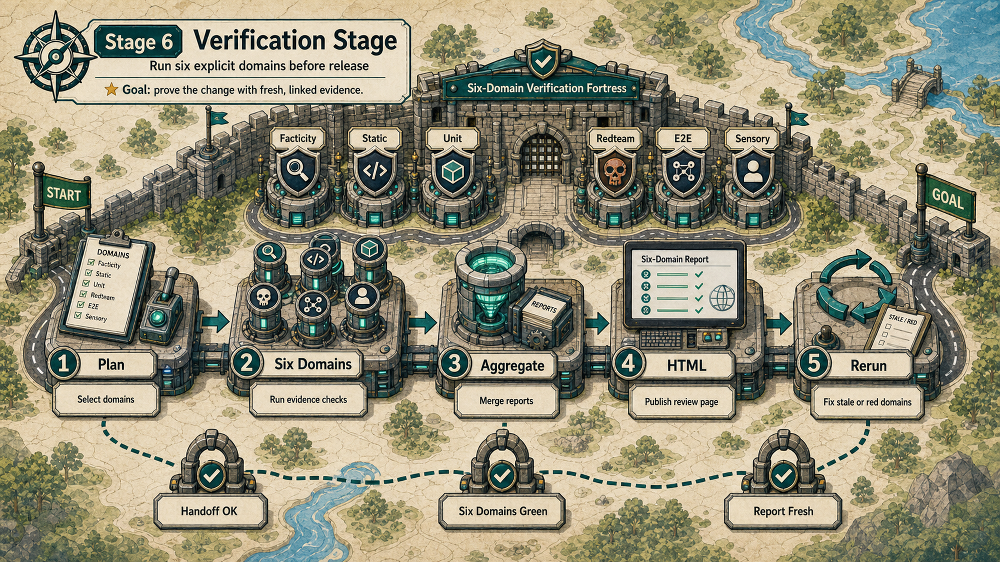
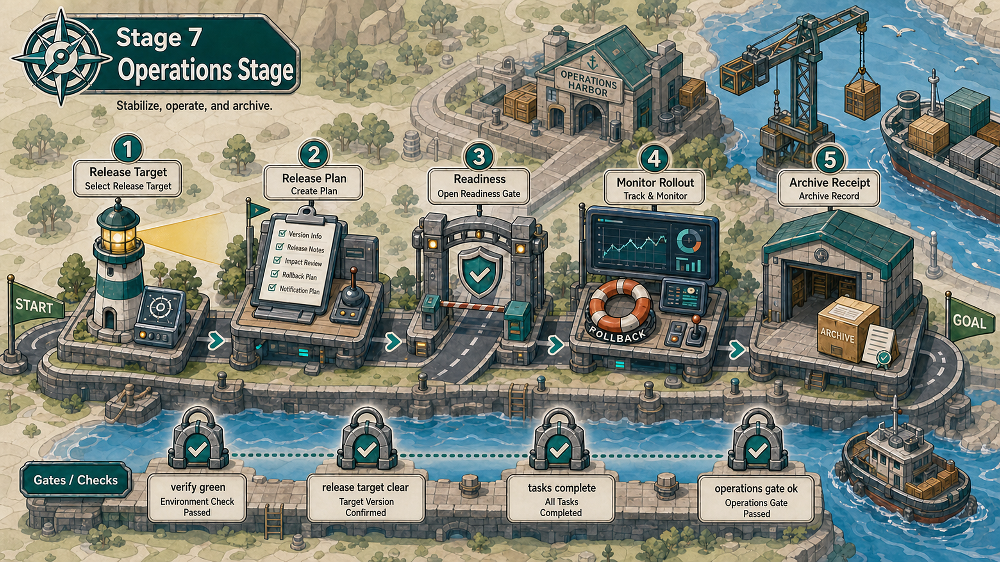

<p align="center">
  
</p>

<h1 align="center">SpecNav Codex Plugin Suite</h1>

<p align="center">
  <strong>OpenSpec-governed delivery flow for Codex.</strong>
</p>

<p align="center">
  <a href="README.zh-CN.md">中文</a> ·
  <a href="#install-from-github">Install</a> ·
  <a href="#how-the-flow-works">Flow</a> ·
  <a href="#stage-atlas">Stage Atlas</a> ·
  <a href="#skills">Skills</a> ·
  <a href="docs/design.md">Design</a>
</p>

<p align="center">
  <code>bootstrap</code> -> <code>discovery</code> -> <code>requirements</code> -> <code>prototype</code> -> <code>development</code> -> <code>verification</code> -> <code>operations</code>
</p>

SpecNav turns AI coding from an open-ended chat into a file-backed software
delivery process. It uses OpenSpec artifacts, Codex skills, plugin hooks, and
deterministic scripts to decide what is legal next, what is blocked, and what
evidence must exist before the agent can move forward.

This repository is a Codex marketplace that ships seven installable plugins:

| Plugin | Responsibility |
| --- | --- |
| `specnav-core` | Runtime, hooks, bootstrap, status, doctor, route, recovery |
| `specnav-requirements` | Repository discovery, foundation specs, requirements questioning |
| `specnav-prototype` | Runnable prototype artifacts, prototype verification, handoff |
| `specnav-development` | Scope lock, vertical slices, fix/debug/break-loop workflows |
| `specnav-verification` | Six-domain verification and stakeholder HTML reports |
| `specnav-operations` | Release readiness, deploy, rollback, monitor, archive action |
| `specnav-codegraph` | CodeGraph policy, context, claims, impact, and evidence artifacts |

`specnav-codegraph` is a cross-cutting evidence layer. It ships with SpecNav,
but CodeGraph setup and per-project indexing remain explicit actions through
`specnav-codegraph-setup` and `specnav-codegraph-init`.

## Stage Atlas

The full lifecycle is intentionally visual: every phase has a gate, artifact
contract, and next-action boundary.

Future SpecNav diagrams should follow the project visual memory:
[docs/memory/specnav-visual-style.md](docs/memory/specnav-visual-style.md).

<p align="center">
  
</p>

<table>
  <tr>
    <td width="50%">
      <strong>1. Bootstrap</strong><br>
      
    </td>
    <td width="50%">
      <strong>2. Discovery</strong><br>
      
    </td>
  </tr>
  <tr>
    <td width="50%">
      <strong>3. Requirements</strong><br>
      
    </td>
    <td width="50%">
      <strong>4. Prototype</strong><br>
      
    </td>
  </tr>
  <tr>
    <td width="50%">
      <strong>5. Development</strong><br>
      
    </td>
    <td width="50%">
      <strong>6. Verification</strong><br>
      
    </td>
  </tr>
  <tr>
    <td colspan="2">
      <strong>7. Operations</strong><br>
      
    </td>
  </tr>
</table>

## Install From GitHub

Add this repository as a Codex marketplace, then install all seven plugins:

```bash
codex plugin marketplace add zengwenliang416/specnav-codex-plugin --ref main

codex plugin add specnav-core@specnav-marketplace
codex plugin add specnav-requirements@specnav-marketplace
codex plugin add specnav-prototype@specnav-marketplace
codex plugin add specnav-development@specnav-marketplace
codex plugin add specnav-verification@specnav-marketplace
codex plugin add specnav-operations@specnav-marketplace
codex plugin add specnav-codegraph@specnav-marketplace
```

Trust the core hooks after installation:

```text
/hooks
```

Start a fresh Codex thread after installing or updating plugins, skills, hooks,
or scripts. Existing threads may not see newly installed capabilities.

## Local Development Install

From a local checkout:

```bash
git clone https://github.com/zengwenliang416/specnav-codex-plugin.git
cd specnav-codex-plugin

codex plugin marketplace add "$PWD"

codex plugin add specnav-core@specnav-marketplace
codex plugin add specnav-requirements@specnav-marketplace
codex plugin add specnav-prototype@specnav-marketplace
codex plugin add specnav-development@specnav-marketplace
codex plugin add specnav-verification@specnav-marketplace
codex plugin add specnav-operations@specnav-marketplace
codex plugin add specnav-codegraph@specnav-marketplace
```

## First Run

Run SpecNav in the target project, not inside this plugin repository.

```text
1. $specnav-doctor
   Check installed plugins, hooks, skills, OpenSpec CLI, and cache visibility.

2. $specnav-workflow
   Read the current affordance table and report the next legal action.

3. $specnav-bootstrap
   Use this only when the project does not yet have OpenSpec state.

4. $specnav-status
   Inspect active change, ready actions, blockers, risk tier, and stale
   verification state.

5. $specnav-requirements
   Start requirements only after OpenSpec and required foundation specs exist.
```

## CodeGraph Evidence Layer

CodeGraph is a code-evidence source, not a replacement for OpenSpec or tests.
SpecNav requires CodeGraph `1.1.6` or newer when a stage policy requires code
evidence.

CodeGraph setup is explicit:

```text
1. $specnav-codegraph-setup
   Check or repair Codex MCP wiring for CodeGraph.

2. $specnav-codegraph-init
   Run project-local CodeGraph initialization only when the user explicitly
   asks for indexing.

3. $specnav-codegraph-status
   Report CLI version, MCP visibility, project index, staleness, and policy.
```

During development and verification, SpecNav writes:

```text
openspec/changes/<change>/codegraph/claims-map.json
openspec/changes/<change>/codegraph/evidence-query-plan.json
openspec/changes/<change>/codegraph/evidence.jsonl
openspec/changes/<change>/codegraph/evidence-index.json
openspec/changes/<change>/codegraph/claims-report.json
```

The execution chain is:

```text
claims-map.json
  -> evidence-query-plan.json
  -> codegraph explore
  -> evidence.jsonl
  -> evidence-index.json
  -> claims-report.json
  -> stage gate
```

If CodeGraph is missing, too old, unindexed, stale, or pointed at the wrong
worktree, required stages block with a concrete `codegraph:*` blocker. There is
no fallback evidence for code-backed claims.

## How The Flow Works

| Stage | Entry | Required evidence | Next gate |
| --- | --- | --- | --- |
| Bootstrap | `$specnav-bootstrap` | `openspec/`, `.specnav/`, `.specnav.json`, workflow state | project can report legal actions |
| Discovery | `$specnav-repository-discovery` | read-only repo evidence and context manifest | foundation specs can be created or repaired |
| Requirements | `$specnav-foundation-specs`, `$specnav-requirements` | four foundation specs, requirements, acceptance criteria, spec map, component impact map | prototype is allowed |
| Prototype | `$specnav-prototype`, `$specnav-prototype-verify`, `$specnav-prototype-handoff` | runnable prototype, verification report, approval/handoff notes | development is allowed |
| Development | `$specnav-development-entry`, `$specnav-scope-lock`, `$specnav-vertical-slices` | committed Git/task baseline, scope lock, complete checkbox tasks, implementation evidence, review/fix loop | verification is allowed |
| Verification | `$specnav-verify-plan` plus six domain skills | facticity, static, unit, redteam, E2E, sensory evidence, aggregate report, HTML report | release planning is allowed |
| Operations | `$specnav-ops-readiness`, `$specnav-release-plan`, deploy/rollback/archive skills | release target, readiness, rollback, monitor, archive receipt | change can be archived |

## Light Lane For Simple Changes

Not every request needs the full requirements -> prototype -> development
packet. `$specnav-route` and `$specnav-development-entry` now run
`change-triage.js` before choosing the next workflow. Simple docs, copy,
labels, comments, README, and very small low-risk styling/config edits route to
the `light` lane and load `$specnav-light-change`.

Light lane still requires an OpenSpec project, a clean active change, standard
checkbox `tasks.md`, a bounded `scope.json`, and machine-checkable
`acceptance.json`. It may skip foundation-spec blocking, runnable prototype
approval, per-slice review packets, and the full six-domain verification set.
Verification is reduced to static + unit evidence.

The lane escalates back to standard or full when the request touches auth,
permissions, billing, security, database, API routes, deployment, package
manifests, SpecNav internals, more than three intended paths, or more than ten
production files after edits. If the intended paths are unclear, SpecNav should
ask for the edit scope before creating light artifacts.

Standard-lane development requires a Git `HEAD` that tracks the approved
`tasks.md`. Milestone sections carry the user-visible outcome while their full
engineering checklists remain intact. Removing, merging, or renumbering a
baseline task blocks development unless an explicit user approval is recorded
in `development/task-change-approval.json`.

## Foundation Spec Gate

Requirements do not begin from feature brainstorming. SpecNav first checks for
four project-level foundation specs:

1. UI design spec, following the project design-system format.
2. Frontend/backend architecture and database design spec.
3. Frontend/backend interaction and data-flow spec.
4. Component architecture constraint spec.

The fourth spec makes high cohesion and low coupling explicit. Repeated UI,
logic, domain utilities, or cross-feature behavior must be extracted into
stable shared components when it forms a reusable unit. Shared components must
declare ownership, props/contracts, state boundaries, and allowed dependencies.

If any foundation spec is missing, SpecNav blocks feature requirements and
guides the user to create or repair the missing spec. There is no fallback.

## Verification Model

The verification stage has six independent test domains:

| Domain | Purpose |
| --- | --- |
| Facticity / authenticity | Compare specs, claims, generated artifacts, and real system state |
| Static analysis | Run lint/type/style/structure checks before runtime testing |
| Unit testing | Validate smallest behavior units and edge cases |
| Red teaming | Probe destructive, adversarial, unsafe, or malformed paths |
| End-to-end testing | Validate real user flows across UI, services, and persistence |
| Sensory / UX audit | Human-in-the-loop review for readability, interaction, performance, and feel |

`$specnav-html-report` turns verification evidence into a reviewable stakeholder
HTML report. A green report must be evidence-backed, current, and linked to the
artifacts it validates.

## No Fallback Contract

SpecNav does not silently continue when required state is missing. If a required
dependency, plugin, OpenSpec command, artifact, state file, context manifest, or
verification tool is unavailable, the dependent action is blocked with a
specific reason.

Allowed while blocked:

- `$specnav-doctor`
- `$specnav-status`
- `$specnav-bootstrap`
- read-only discovery
- OpenSpec artifact repair
- docs-only edits that do not touch production code

## Archive Contract

Archive is an explicit operation, not a passive status.

After readiness is green, run:

```bash
node "$SPECNAV_OPERATIONS_ROOT/scripts/archive-change.js" --change <change> --json
```

The archive action normalizes `tasks.md`, requires completed checkbox tasks,
runs `openspec validate`, runs `openspec archive`, updates SpecNav change focus,
rewrites archived evidence paths, and writes
`operations/archive-receipt.json` inside the archived change.

Plain bullets in `tasks.md` are not completion evidence. Tasks must use:

```markdown
- [ ] Not done yet
- [x] Completed with evidence
```

## Skills

Core:

```text
specnav-workflow
specnav-bootstrap
specnav-route
specnav-status
specnav-doctor
specnav-debug
specnav-recovery
```

Requirements:

```text
specnav-repository-discovery
specnav-foundation-specs
specnav-requirements
```

Prototype:

```text
specnav-prototype
specnav-prototype-verify
specnav-prototype-handoff
```

Development:

```text
specnav-development-entry
specnav-scope-lock
specnav-vertical-slices
specnav-fix
specnav-debug
specnav-break-loop
```

Verification:

```text
specnav-verify-plan
specnav-verify-facticity
specnav-verify-static
specnav-verify-unit
specnav-verify-redteam
specnav-verify-e2e
specnav-verify-sensory
specnav-verify-rerun
specnav-html-report
```

Operations:

```text
specnav-ops-readiness
specnav-release-plan
specnav-install-verify
specnav-update-policy
specnav-compatibility-matrix
specnav-branch-finish
specnav-deploy
specnav-rollback
specnav-monitor
specnav-postmortem
specnav-update-spec
```

## Repository Layout

```text
.agents/plugins/marketplace.json          Codex marketplace manifest
plugins/specnav-core/                     runtime, router, hooks, status, doctor
plugins/specnav-requirements/             discovery, foundation specs, requirements
plugins/specnav-prototype/                runnable prototype and handoff
plugins/specnav-development/              scope lock and vertical-slice implementation
plugins/specnav-verification/             six-domain verification and HTML report
plugins/specnav-operations/               release, deploy, rollback, archive
plugins/specnav-codegraph/                CodeGraph policy and evidence layer
docs/design.md                            system design
docs/assets/readme/                       README stage diagrams
tests/                                    fixture and smoke tests
```

## Checks

Run the fast smoke check:

```bash
npm test
```

Run all fixture checks:

```bash
for test_script in tests/run-*.sh; do
  bash "$test_script"
done
```

Targeted checks:

```bash
bash tests/run-codex-marketplace-fixtures.sh
bash tests/run-codex-plugin-fixtures.sh
bash tests/run-codex-skill-fixtures.sh
bash tests/run-codex-hook-fixtures.sh
bash tests/run-plugin-suite-resolver-fixtures.sh
bash tests/run-task-checkbox-contract-fixtures.sh
bash tests/run-operations-archive-action-fixtures.sh
```

## References

- [System design](docs/design.md)
- [Visual style memory](docs/memory/specnav-visual-style.md)
- [Codex marketplace manifest](.agents/plugins/marketplace.json)
- [4K transparent logo](docs/assets/specnav-logo-4k.png)
