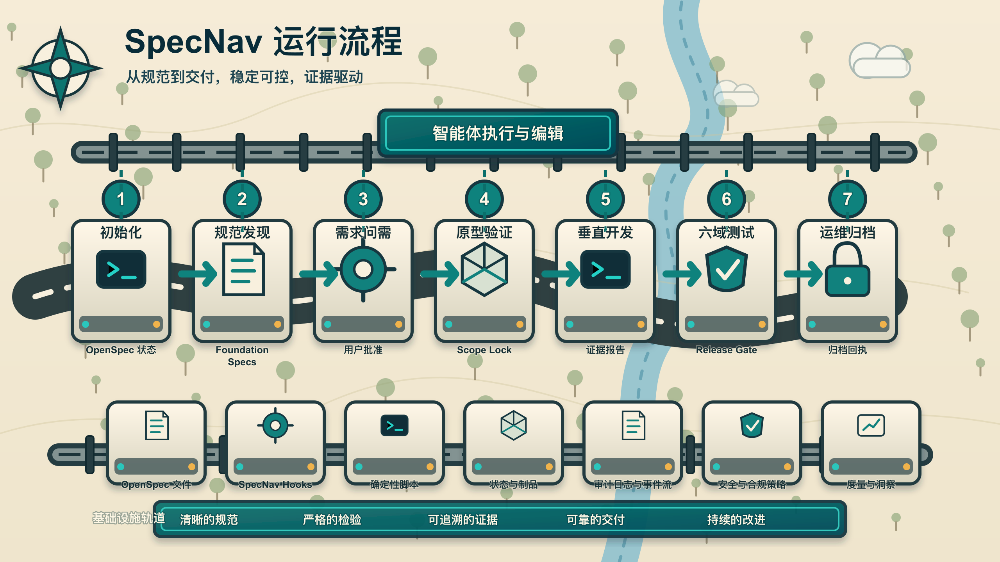
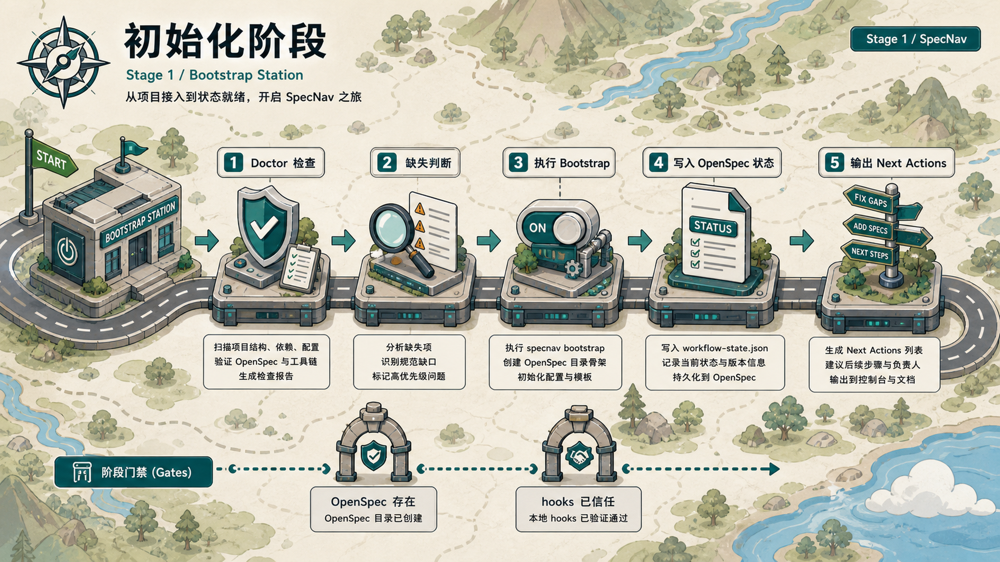
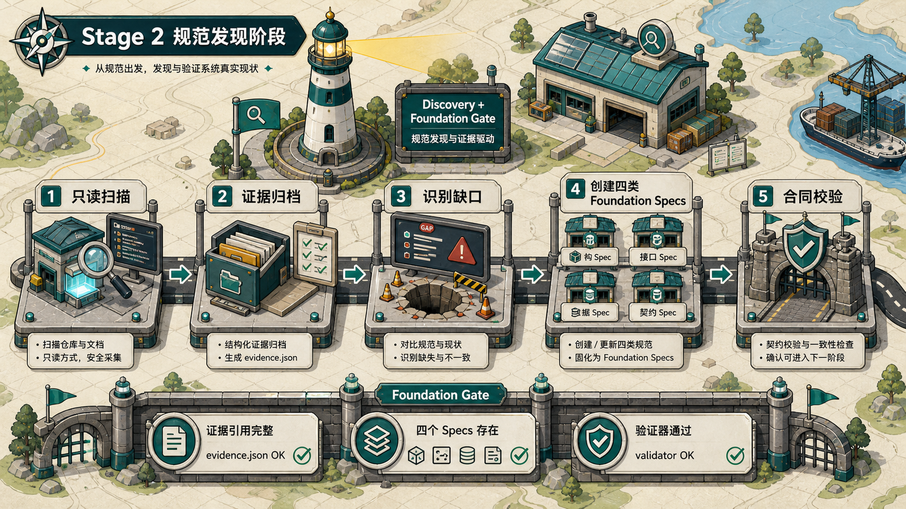
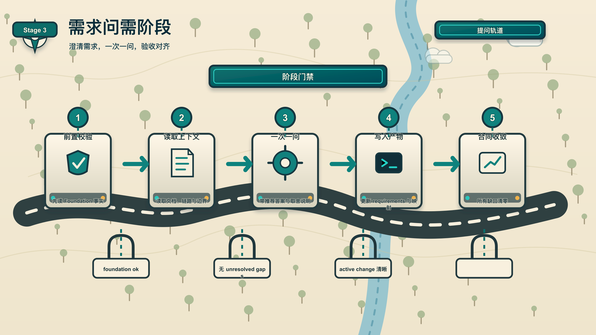
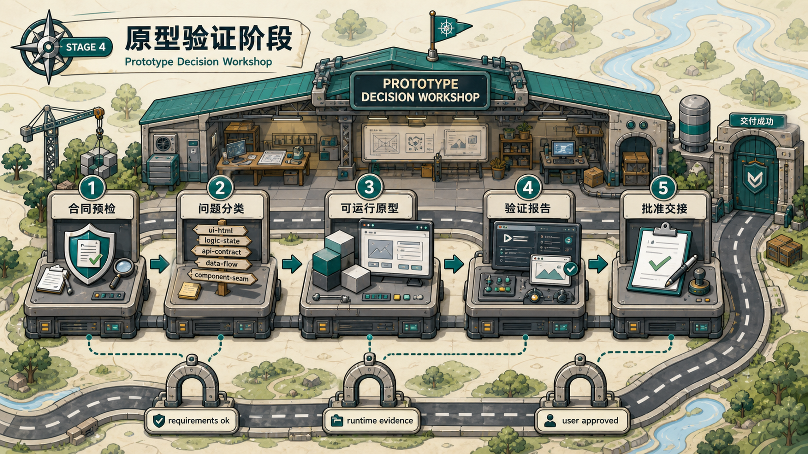
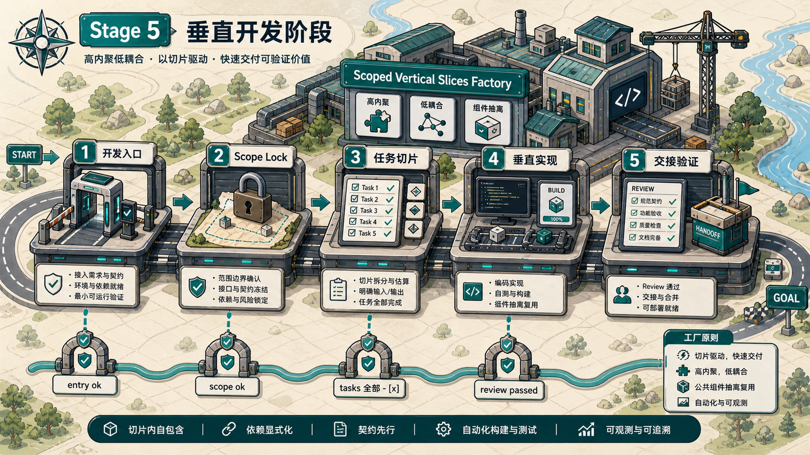

<p align="center">
  
</p>

<h1 align="center">SpecNav Codex 插件套件</h1>

<p align="center">
  <strong>面向 Codex 的 OpenSpec 约束型交付流程。</strong>
</p>

<p align="center">
  <a href="README.md">English</a> ·
  <a href="#从-github-安装">安装</a> ·
  <a href="#流程如何运行">流程</a> ·
  <a href="#阶段图谱">阶段图谱</a> ·
  <a href="#skills">Skills</a> ·
  <a href="docs/verification-2-0.zh-CN.md">Verification 2.0</a> ·
  <a href="docs/design.md">设计文档</a>
</p>

<p align="center">
  <code>初始化</code> -> <code>规范发现</code> -> <code>需求</code> -> <code>原型</code> -> <code>开发</code> -> <code>验证</code> -> <code>运维</code>
</p>

SpecNav 把 AI 编码从开放式聊天，收束成有文件证据、有阶段边界、有下一步判断的工程交付流程。它通过 OpenSpec 产物、Codex skills、插件 hooks 和确定性脚本判断：现在什么动作合法、什么动作被阻塞、继续前必须补齐什么证据。

这个仓库是一个 Codex marketplace，里面包含七个可安装插件：

| 插件 | 职责 |
| --- | --- |
| `specnav-core` | 运行时、hooks、bootstrap、status、doctor、route、recovery |
| `specnav-requirements` | 仓库发现、foundation specs、需求问需 |
| `specnav-prototype` | 可运行原型、原型验证、开发交接 |
| `specnav-development` | Scope lock、垂直切片、fix/debug/break-loop 流程 |
| `specnav-verification` | 完整 Verification 2.0 运行时、批准用例、六域证据、修复循环、门禁和审阅报告 |
| `specnav-operations` | 发布准备、部署、回滚、监控、归档动作 |
| `specnav-codegraph` | CodeGraph policy、context、claims、impact 和证据产物 |

`specnav-codegraph` 是横跨所有阶段的代码证据层。它会随 SpecNav suite
发布，但 CodeGraph 的 MCP 设置和每个项目的索引初始化都必须通过
`specnav-codegraph-setup`、`specnav-codegraph-init` 显式执行。

## 阶段图谱

整个生命周期不是一组松散提示词，而是一条带 gate、产物合同和下一步边界的路线。

后续新增 SpecNav 图像时，应先遵循项目视觉记忆：
[docs/memory/specnav-visual-style.md](docs/memory/specnav-visual-style.md)。

<p align="center">
  
</p>

<table>
  <tr>
    <td width="50%">
      <strong>1. 初始化</strong><br>
      
    </td>
    <td width="50%">
      <strong>2. 规范发现</strong><br>
      
    </td>
  </tr>
  <tr>
    <td width="50%">
      <strong>3. 需求问需</strong><br>
      
    </td>
    <td width="50%">
      <strong>4. 原型验证</strong><br>
      
    </td>
  </tr>
  <tr>
    <td width="50%">
      <strong>5. 垂直开发</strong><br>
      
    </td>
    <td width="50%">
      <strong>6. 六域验证</strong><br>
      
    </td>
  </tr>
  <tr>
    <td colspan="2">
      <strong>7. 运维归档</strong><br>
      
    </td>
  </tr>
</table>

## 从 GitHub 安装

把本仓库添加为 Codex marketplace，然后安装七个插件：

```bash
codex plugin marketplace add zengwenliang416/specnav-codex-plugin --ref main

codex plugin add specnav-core@specnav-marketplace
codex plugin add specnav-requirements@specnav-marketplace
codex plugin add specnav-prototype@specnav-marketplace
codex plugin add specnav-development@specnav-marketplace
codex plugin add specnav-verification@specnav-marketplace
codex plugin add specnav-operations@specnav-marketplace
codex plugin add specnav-codegraph@specnav-marketplace
```

安装后信任 core hooks：

```text
/hooks
```

安装或更新 plugins、skills、hooks、scripts 后，请启动新的 Codex 会话。旧会话不一定能看到刚安装的能力。

## 本地开发安装

从本地 checkout 安装：

```bash
git clone https://github.com/zengwenliang416/specnav-codex-plugin.git
cd specnav-codex-plugin

codex plugin marketplace add "$PWD"

codex plugin add specnav-core@specnav-marketplace
codex plugin add specnav-requirements@specnav-marketplace
codex plugin add specnav-prototype@specnav-marketplace
codex plugin add specnav-development@specnav-marketplace
codex plugin add specnav-verification@specnav-marketplace
codex plugin add specnav-operations@specnav-marketplace
codex plugin add specnav-codegraph@specnav-marketplace
```

## 第一次使用

SpecNav 要在目标项目里运行，不是在这个插件仓库里继续操作。

```text
1. $specnav-doctor
   检查七个插件、hooks、skills、OpenSpec CLI 和 installed cache 是否可见。

2. $specnav-workflow
   读取当前 affordance table，报告下一步合法动作。

3. $specnav-bootstrap
   只在目标项目没有 OpenSpec 状态时使用。

4. $specnav-status
   查看 active change、ready actions、blockers、risk tier 和 stale verification 状态。

5. $specnav-requirements
   只有 OpenSpec 和必要 foundation specs 存在后，才进入需求问需。
```

## CodeGraph 证据层

CodeGraph 是代码证据来源，不替代 OpenSpec，也不替代测试。当阶段策略要求代码证据时，SpecNav 要求 CodeGraph `1.1.6` 或更新版本。

CodeGraph 设置必须显式执行：

```text
1. $specnav-codegraph-setup
   检查或修复 Codex 的 CodeGraph MCP 配置。

2. $specnav-codegraph-init
   只有用户明确要求索引当前项目时，才初始化项目本地 CodeGraph index。

3. $specnav-codegraph-status
   报告 CLI 版本、MCP 可见性、项目 index、新鲜度和 policy。
```

开发和验证阶段会写入：

```text
openspec/changes/<change>/codegraph/claims-map.json
openspec/changes/<change>/codegraph/evidence-query-plan.json
openspec/changes/<change>/codegraph/evidence.jsonl
openspec/changes/<change>/codegraph/evidence-index.json
openspec/changes/<change>/codegraph/claims-report.json
```

执行链路是：

```text
claims-map.json
  -> evidence-query-plan.json
  -> codegraph explore
  -> evidence.jsonl
  -> evidence-index.json
  -> claims-report.json
  -> stage gate
```

如果 CodeGraph 缺失、版本过低、未索引、证据过期，或指向了错误 worktree，required 阶段会用明确的 `codegraph:*` blocker 阻断。代码声明没有 fallback 证据。

## 流程如何运行

| 阶段 | 入口 | 必要证据 | 下一道 gate |
| --- | --- | --- | --- |
| 初始化 | `$specnav-bootstrap` | `openspec/`、`.specnav/`、`.specnav.json`、workflow state | 项目能报告合法动作 |
| 规范发现 | `$specnav-repository-discovery` | 只读仓库证据和 context manifest | 可以创建或修复 foundation specs |
| 需求 | `$specnav-foundation-specs`、`$specnav-requirements` | 四类 foundation specs、requirements、acceptance、spec map、component impact map | 允许进入原型 |
| 原型 | `$specnav-prototype`、`$specnav-prototype-verify`、`$specnav-prototype-handoff` | 可运行原型、验证报告、批准/交接说明 | 允许进入开发 |
| 开发 | `$specnav-development-entry`、`$specnav-scope-lock`、`$specnav-vertical-slices` | 已提交的 Git/任务基线、scope lock、完整 checkbox tasks、实现证据、review/fix loop | 允许进入验证 |
| 验证 | `$specnav-verify-plan` 加六个 domain skills | 真实性、静态、单元、红队、E2E、体感证据，聚合报告，HTML 报告 | 允许进入发布计划 |
| 运维 | `$specnav-ops-readiness`、`$specnav-release-plan`、deploy/rollback/archive skills | release target、readiness、rollback、monitor、archive receipt | 允许归档 change |

## 简单需求的 Light Lane

不是每个需求都需要完整的 requirements -> prototype -> development
制品包。`$specnav-route` 和 `$specnav-development-entry` 会先运行
`change-triage.js` 判断请求复杂度。简单文档、文案、标签、注释、
README，以及极小范围的低风险样式或配置调整，会进入 `light` lane
并加载 `$specnav-light-change`。

Light lane 仍然要求目标项目已有 OpenSpec、存在明确 active change、使用标准
checkbox `tasks.md`、写出有边界的 `scope.json`，并提供机器可检查的
`acceptance.json`。它只能缩减低风险小改动的需求、原型和逐切片开发文档，
不能降低测试门禁：所有 lane 都必须进入 Verification 2.0，批准不可变用例
快照，执行全部六个测试域，校验证据完整性和新鲜度，完成 repair/regression，
并使用同一个 release decision。

如果请求触碰 auth、permission、billing、security、database、API route、deployment、package manifest、SpecNav 内部文件，或者预计超过三个路径、实际超过十个生产文件，必须升级回 standard 或 full lane。如果预计修改路径不清楚，SpecNav 需要先问清范围，再创建 light 制品。

Standard lane 开发必须先存在一个已跟踪批准版 `tasks.md` 的 Git `HEAD`。
每个里程碑负责表达用户可见结果，其下的完整工程 checkbox 不得为了通过合同而删除、
合并或改号。确需缩减任务时，必须把用户的显式批准记录到
`development/task-change-approval.json`，否则开发入口直接阻塞。

## Foundation Spec Gate

需求阶段不从功能畅想开始。SpecNav 会先检查四类项目级 foundation specs：

1. UI 设计 spec，遵循项目 design system 格式。
2. 前后端架构和数据库设计 spec。
3. 前后端交互逻辑和数据流向 spec。
4. 组件架构约束 spec。

第四类 spec 明确约束高内聚、低耦合。当重复 UI、重复逻辑、领域工具或跨功能行为形成稳定复用单元时，必须抽离为共享组件。共享组件必须声明 ownership、props/contracts、状态边界和允许依赖。

如果任何 foundation spec 缺失，SpecNav 会阻塞功能问需，并引导用户创建或修复缺失 spec。这里没有 fallback。

## Verification 2.0

Verification 2.0 没有 light、compact、部分测试域、人工改绿或 fallback
路径。先运行 `specnav-verification-runtime-status`；只有得到明确批准后才能
运行 `specnav-verification-runtime-setup`；然后使用 `specnav-verify-plan`
并执行全部六个测试域。

锁定运行时会把 Playwright、Midscene、AJV、托管 Chromium 和 FFmpeg 安装到
`~/.specnav/runtime/verification/<version>/`，不会修改业务仓库。Midscene
可以辅助 UI 交互，但 PASS 必须由确定性断言或明确人工 signoff 决定。HTML
报告只是审阅投影；机器权威由 `verify/v2/report-model.json`、release/archive
gate decision 和 `verify/v2/report-render-manifest.json` 共同绑定。

完整的安装、doctor、批准、执行、修复、报告、迁移、宿主和排障说明见
[docs/verification-2-0.zh-CN.md](docs/verification-2-0.zh-CN.md)。

验证阶段包含六个独立测试域：

| 测试域 | 目的 |
| --- | --- |
| 真实性 / authenticity | 对照 specs、声明、生成产物和真实系统状态 |
| 静态检查 | 在运行时测试前执行 lint/type/style/structure 检查 |
| 单元测试 | 验证最小行为单元和边界条件 |
| 红队破坏 | 探测破坏性、对抗性、不安全或畸形路径 |
| E2E 测试 | 验证跨 UI、服务和持久化的真实用户流程 |
| 体感 / UX 审计 | 人工审阅可读性、交互、性能和整体体验 |

`$specnav-html-report` 会把验证证据生成面向审阅人的 HTML 报告。Green 报告必须有证据、保持新鲜，并链接到被验证的产物。

## 无 Fallback 合同

SpecNav 不会在必要状态缺失时悄悄继续。如果 required dependency、plugin、OpenSpec command、artifact、state file、context manifest 或 verification tool 不可用，依赖动作会被明确 blocker 阻断。

阻塞态允许的动作：

- `$specnav-doctor`
- `$specnav-status`
- `$specnav-bootstrap`
- read-only discovery
- OpenSpec artifact repair
- 不触碰生产代码的 docs-only edits

## 归档合同

归档是明确动作，不是被动状态。

readiness 为 green 后，运行：

```bash
node "$SPECNAV_OPERATIONS_ROOT/scripts/archive-change.js" --change <change> --json
```

归档动作会标准化 `tasks.md`，要求已完成 checkbox tasks，执行 `openspec validate`，执行 `openspec archive`，更新 SpecNav change focus，重写归档后的 evidence 路径，并在归档后的 change 中写入 `operations/archive-receipt.json`。

`tasks.md` 里的普通 bullet 不是完成证据。任务必须使用：

```markdown
- [ ] 未完成
- [x] 已完成且有证据
```

## Skills

Core:

```text
specnav-workflow
specnav-bootstrap
specnav-route
specnav-status
specnav-doctor
specnav-debug
specnav-recovery
```

Requirements:

```text
specnav-repository-discovery
specnav-foundation-specs
specnav-requirements
```

Prototype:

```text
specnav-prototype
specnav-prototype-verify
specnav-prototype-handoff
```

Development:

```text
specnav-development-entry
specnav-scope-lock
specnav-vertical-slices
specnav-fix
specnav-debug
specnav-break-loop
```

Verification:

```text
specnav-verification
specnav-verification-runtime-status
specnav-verification-runtime-setup
specnav-verify-plan
specnav-verify-facticity
specnav-verify-static
specnav-verify-unit
specnav-verify-redteam
specnav-verify-e2e
specnav-verify-sensory
specnav-verify-rerun
specnav-html-report
```

Operations:

```text
specnav-ops-readiness
specnav-release-plan
specnav-install-verify
specnav-update-policy
specnav-compatibility-matrix
specnav-branch-finish
specnav-deploy
specnav-rollback
specnav-monitor
specnav-postmortem
specnav-update-spec
```

## 仓库结构

```text
.agents/plugins/marketplace.json          Codex marketplace manifest
plugins/specnav-core/                     runtime、router、hooks、status、doctor
plugins/specnav-requirements/             discovery、foundation specs、requirements
plugins/specnav-prototype/                runnable prototype 和 handoff
plugins/specnav-development/              scope lock 和 vertical-slice implementation
plugins/specnav-verification/             six-domain verification 和 HTML report
plugins/specnav-operations/               release、deploy、rollback、archive
plugins/specnav-codegraph/                CodeGraph policy 和 evidence layer
docs/design.md                            系统设计文档
docs/assets/readme/                       README 阶段图
tests/                                    fixture 和 smoke tests
```

## 检查

运行快速 smoke check：

```bash
npm test
```

运行全部 fixture checks：

```bash
for test_script in tests/run-*.sh; do
  bash "$test_script"
done
```

定向检查：

```bash
bash tests/run-codex-marketplace-fixtures.sh
bash tests/run-codex-plugin-fixtures.sh
bash tests/run-codex-skill-fixtures.sh
bash tests/run-codex-hook-fixtures.sh
bash tests/run-plugin-suite-resolver-fixtures.sh
bash tests/run-task-checkbox-contract-fixtures.sh
bash tests/run-operations-archive-action-fixtures.sh
```

## 参考

- [系统设计](docs/design.md)
- [Verification 2.0 指南](docs/verification-2-0.zh-CN.md)
- [视觉风格记忆](docs/memory/specnav-visual-style.md)
- [Codex marketplace manifest](.agents/plugins/marketplace.json)
- [4K 透明 logo](docs/assets/specnav-logo-4k.png)
