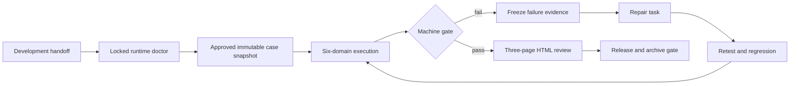

# SpecNav Verification 2.0

[中文](verification-2-0.zh-CN.md)

Verification 2.0 is the mandatory evidence-backed quality gate after
development. It has no light, compact, partial-domain, manual-green, or
fallback path. A simple change may use a lighter requirements or development
packet, but it still runs the complete approved case contract and all six test
domains before release or archive.

HTML is not the source of truth. The machine authority is the validated
`verify/v2/report-model.json` plus the release and archive gate decisions.
`verify/v2/report-render-manifest.json` binds that model to the exact hashes
and sizes of the three HTML projections.



## Runtime Setup And Doctor

The managed runtime is installed side-by-side under:

```text
~/.specnav/runtime/verification/<version>/
```

The current lock is:

| Component | Locked version |
| --- | --- |
| Verification Runtime | `2.0.0-alpha.1` |
| Playwright | Playwright 1.62.1 |
| Midscene | Midscene 1.10.8 |
| AJV | AJV 8.20.0 |
| AJV formats | `3.0.1` |
| Node.js | major 20 through 24 |
| Initial platform | `darwin-arm64` |
| Visual understanding model | `gpt-5.6-luna` |

Run doctor first. It is read-only:

```bash
node "$SPECNAV_VERIFICATION_ROOT/scripts/verification-runtime.js" doctor \
  --version "2.0.0-alpha.1" \
  --project "$PWD" \
  --json
```

Add `--requires-midscene` only when an approved selected case uses Midscene.
Doctor reports exact package, browser, permission, receipt, Kernel, lock, and
redacted provider blockers. It never installs or repairs.

Installation is a separate, explicit action and requires user approval:

```bash
node "$SPECNAV_VERIFICATION_ROOT/scripts/verification-runtime.js" install \
  --version "2.0.0-alpha.1" \
  --project "$PWD" \
  --json
```

Use `specnav-verification-runtime-status` for diagnosis and
`specnav-verification-runtime-setup` for an approved install or repair. The
installer must not change the business repository's package manifest or
lockfile. It uses the locked managed packages, browser artifacts, and receipt;
it does not substitute globally installed tooling or another browser.

Expected output includes:

```text
~/.specnav/runtime/verification/2.0.0-alpha.1/install-receipt.json
package-lock.json
browser INSTALLATION_COMPLETE markers
preserved .failed-* attempts when installation fails
```

The receipt is not only an installation log. It binds the exact package lock,
the complete managed `node_modules` tree through `module_tree_sha256`, the
Verification Kernel contract digest, and every managed browser executable
through `executable_sha256`. Doctor and release proof recalculate these values
from the live runtime. A saved `runtime-status.json` cannot make a modified,
missing, or substituted runtime authoritative.

## Case Approval

Run `specnav-verify-plan` after development handoff. It creates test cases with
actors, preconditions, steps, assertions, runner identities, six-domain
mappings, and evidence requirements.

No case may execute until the user approves the exact immutable case snapshot.
Changing requirements, acceptance criteria, case content, snapshot hash, or
reviewer identity invalidates the approval and requires a new signoff.

The plan must cover every requirement and acceptance assertion. Empty plans,
unknown references, incomplete domain mappings, or service-authored approval
block execution.

The normalized inputs are persisted separately:

```text
verify/v2/requirements-source.json
verify/v2/acceptance-source.json
verify/v2/case-snapshot.json
verify/v2/case-approval.json
```

The snapshot hashes the normalized requirements and acceptance sources. The
approval must bind the exact snapshot id and hash, change id, decision time,
and an external reviewer identity supplied again at execution. The reviewer
must be `kind: "human"`; an agent, service, or mismatched reviewer id cannot
approve its own generated plan.

## Six-Domain Execution

Every approved case receives terminal readings in all six domains:

| Domain id | Skill | Required proof |
| --- | --- | --- |
| `facticity` | `specnav-verify-facticity` | Spec, claim, artifact, and real-state agreement |
| `static` | `specnav-verify-static` | Lint, type, style, structure, and policy checks |
| `unit` | `specnav-verify-unit` | Deterministic behavior and edge-case assertions |
| `redteam` | `specnav-verify-redteam` | Malformed, destructive, adversarial, and permission paths |
| `e2e` | `specnav-verify-e2e` | Real user flow across UI, services, and persistence |
| `sensory` | `specnav-verify-sensory` | Readability, interaction, responsiveness, and human review |

Inspect the host contract and validate the current state:

```bash
node "$SPECNAV_VERIFICATION_ROOT/scripts/codex-verification-adapter.js" describe --json

node "$SPECNAV_VERIFICATION_ROOT/scripts/codex-verification-adapter.js" validate \
  --project "$PWD" \
  --change "<change-id>" \
  --reviewer-id "<authenticated-human-id>" \
  --json
```

A final green result requires `verification_mode: "full"`, all six domains,
fresh content-addressed evidence, and `fallback_used: false`.

Execute the approved snapshot:

```bash
node "$SPECNAV_VERIFICATION_ROOT/scripts/codex-verification-adapter.js" execute \
  --project "$PWD" \
  --change "<change-id>" \
  --reviewer-id "<authenticated-human-id>" \
  --json
```

Add `--scenario-registry "<project-relative-module>"` when an approved
Playwright or Midscene case uses project-owned scenario code. The registry is
loaded only after exact snapshot approval passes and must resolve inside the
project without symbolic links.

Execution is also bound to the current repository state:

- `--change` must name the registered active change and use a safe single path
  segment;
- the business repository must have a valid, clean Git `HEAD`;
- code and test fingerprints are derived from that exact commit;
- a scenario registry must be a regular
  `tests/specnav/*.js` or `tests/specnav/*.cjs` file whose working-tree bytes
  equal `git show HEAD:<path>`;
- registry top-level code is evaluated in a separate Node permission process
  with no filesystem-write, network, or subprocess permission.

An unregistered, inactive, dirty, symlinked, untracked, changed, or
out-of-scope scenario blocks before a run directory or product process is
created.

## Midscene Oracle Boundary

Midscene may locate elements, interact with the UI, and interpret visual state.
The configured visual understanding model remains `gpt-5.6-luna`.

Midscene or any other model cannot independently declare PASS. Every successful
AI-assisted step must resolve to at least one deterministic assertion,
structured fact, or explicit human signoff. Provider model names, endpoints,
credentials, init JSON, and proxy values are redacted from evidence and HTML.

Playwright remains the deterministic browser execution and artifact path.
Screenshots, videos, traces, console records, network records, and assertions
must bind to the exact run, attempt, case, step or assertion, code SHA, test
SHA, environment hash, and approved scenario hash.

## Evidence And Attempt Integrity

Evidence is append-only and content addressed. Every attempt writes an
immutable integrity result at:

```text
verify/runs/<run-id>/attempts/<attempt-id>/integrity.json
```

The run-level `verify/runs/<run-id>/integrity.json` aggregates every attempt in
that run without replacing earlier failures. Finalization derives
`verify/v2/integrity.json` from the complete persisted history. Missing,
tampered, stale, cross-run, cross-case, or incorrectly fingerprinted evidence
blocks the corresponding reading and therefore the six-domain gate.

## Repair, Retest, And Regression

Use `specnav-verify-rerun` when a case fails. Do not overwrite the first failed
attempt.

```text
FAIL
  -> freeze failure packet and evidence
  -> classify product, test, environment, or flaky cause
  -> create a scoped development repair task
  -> review the repair
  -> retest the exact failed case
  -> run directly impacted and policy baseline regression cases
  -> aggregate again
```

An unchanged-fingerprint retry that later passes is `FLAKY`, not plain PASS.
A repaired case that passes is `PASS AFTER FIX`. Repeated no-progress attempts
route to break-loop governance.

Retry stays inside the original run. Retest and regression always create new
runs whose `origin_run_id`, `parent_run_id`, `parent_attempt_id`, and
`failure_id` bind them to the frozen failure history. Execute them explicitly:

```bash
node "$SPECNAV_VERIFICATION_ROOT/scripts/codex-verification-adapter.js" \
  execute --project "$PWD" --change "<change-id>" \
  --reviewer-id "<human-id>" --case "<case-id>" \
  --attempt-kind retest --parent-attempt "<failed-attempt-id>" \
  --failure-id "<failure-id>" --json
```

## Reports

After the machine gate is computed, `specnav-html-report` renders:

```text
verify/reports/overview.html
verify/reports/test-case-catalog.html
verify/reports/test-case-results.html
```

- `overview.html` shows lifecycle readiness, six-domain status, blockers,
  freshness, integrity, repair state, and release verdict.
- `test-case-catalog.html` shows the approved case contract and coverage.
- `test-case-results.html` shows runs, attempts, readings, commands, evidence,
  hashes, freshness, failures, repairs, retests, and regression history.

Reports render green, red, blocked, running, canceled, stale, flaky, and
pass-after-fix states with the same navigation. Editing HTML cannot change the
DecisionEngine result. Finalization also writes:

```text
verify/v2/gate-input.json
verify/v2/release-gate.json
verify/v2/archive-gate.json
verify/v2/report-model.json
verify/v2/report-render-manifest.json
```

The release proof recomputes gate and report identities and verifies every
rendered page against the manifest.

## V1 Migration

Migration is explicit and preserves V1 artifacts:

```bash
node "$SPECNAV_VERIFICATION_ROOT/scripts/codex-verification-adapter.js" \
  migrate-dry-run --project "$PWD" --json
```

Apply and rollback are mutation actions and require explicit approval:

```bash
node "$SPECNAV_VERIFICATION_ROOT/scripts/codex-verification-adapter.js" \
  migrate-apply --project "$PWD" --approved --json

node "$SPECNAV_VERIFICATION_ROOT/scripts/codex-verification-adapter.js" \
  migrate-rollback --project "$PWD" --approved --json
```

Migration writes a backup reference, transformation result, validation result,
receipt, and rollback instructions. Missing V1 evidence never becomes V2 PASS.

## Host Installation

The Verification Kernel is shared; installation and discovery are host-specific:

- Codex: install `specnav-verification@specnav-marketplace` from this
  marketplace, trust hooks, and start a new task.
- Claude Code: follow [Claude Code integration](host-integration-claude-code.md).
- CodeFree-O: follow [CodeFree-O integration](host-integration-codefree-o.md).

Cross-host release governance compares the locked Kernel, schemas, blockers,
fixtures, report model, host wrappers, and source provenance. CI detects drift;
it never rewrites downstream repositories.

Release and archive use a live host authority, not only the persisted
`operations/cross-host-compatibility.json`. The authority resolves each
repository's real path, requires a clean worktree, verifies its exact lock-bound
Git `HEAD`, rebuilds the compatibility snapshot from the current plugin tree,
manifest, Skill files, and host wrappers, then compares all hosts. Persisted
green host receipts or compatibility data cannot override a live red result.

## Blockers And Troubleshooting

| Blocker family | Meaning | Required action |
| --- | --- | --- |
| `verification-runtime:*` | Runtime, lock, package, browser, permission, receipt, or provider problem | Run `specnav-verification-runtime-status`; use the exact returned action |
| `verify:user-test-cases-unapproved` | Current immutable case snapshot has no valid human approval | Review and approve the current snapshot |
| `verification-evidence:*` | Missing, stale, tampered, unbound, or invalid evidence | Repair evidence production and rerun affected cases |
| `verification-production:*` | Approval, assertion protocol, scenario registry, execution persistence, or report derivation problem | Repair the exact artifact or approved runner input; do not bypass execution |
| `verification-release:*` | Gate, report model, render manifest, host receipt, or release binding mismatch | Regenerate from current V2 facts and rerun release proof |
| `verification-drift:*` | Host Kernel, schema, manifest, source, fixture, blocker, or report drift | Synchronize from a clean canonical commit, commit the host, and update the immutable lock |
| `verification-migration:*` | V1 request, runtime, integrity, transformation, or rollback problem | Repair the migration request or runtime; do not manufacture V2 green |

When blocked, report the exact blocker id and artifact. Do not continue with a
fallback, fewer domains, an edited green JSON file, agent prose, or HTML.
