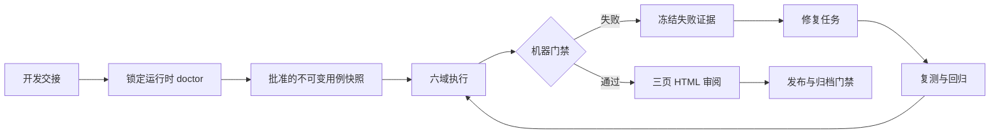

# SpecNav Verification 2.0

[English](verification-2-0.md)

Verification 2.0 是开发完成后的强制证据门禁。它没有 light、compact、
部分测试域、人工改绿或 fallback 路径。简单需求可以使用更轻量的需求或
开发制品包，但发布或归档前仍然必须执行完整批准用例和全部六个测试域。

HTML is not the source of truth（HTML 不是事实源）。机器权威是经过校验的
`verify/v2/report-model.json` 与 release/archive gate decision。
`verify/v2/report-render-manifest.json` 会把该模型绑定到三页 HTML 的准确
hash 和 size。



## 运行时安装与诊断

托管运行时按版本并行安装到：

```text
~/.specnav/runtime/verification/<version>/
```

当前锁定版本：

| 组件 | 锁定版本 |
| --- | --- |
| Verification Runtime | `2.0.0-alpha.1` |
| Playwright | Playwright 1.62.1 |
| Midscene | Midscene 1.10.8 |
| AJV | AJV 8.20.0 |
| AJV formats | `3.0.1` |
| Node.js | major 20 到 24 |
| 初始平台 | `darwin-arm64` |
| 视觉理解模型 | `gpt-5.6-luna` |

先运行只读 doctor：

```bash
node "$SPECNAV_VERIFICATION_ROOT/scripts/verification-runtime.js" doctor \
  --version "2.0.0-alpha.1" \
  --project "$PWD" \
  --json
```

只有批准用例使用 Midscene 时才增加 `--requires-midscene`。doctor 会报告
package、browser、permission、receipt、Kernel、lock 和脱敏 provider 的
准确 blocker，但不会安装或修复。

安装是独立写操作，必须先获得用户明确批准：

```bash
node "$SPECNAV_VERIFICATION_ROOT/scripts/verification-runtime.js" install \
  --version "2.0.0-alpha.1" \
  --project "$PWD" \
  --json
```

使用 `specnav-verification-runtime-status` 做诊断，使用
`specnav-verification-runtime-setup` 执行已批准的安装或修复。安装器不得
修改业务项目的 package manifest 或 lockfile，只能使用锁定的托管 package、
浏览器制品和 receipt，不能换用全局工具、系统浏览器或其他版本。

预期产物：

```text
~/.specnav/runtime/verification/2.0.0-alpha.1/install-receipt.json
package-lock.json
browser INSTALLATION_COMPLETE markers
安装失败时保留的 .failed-* attempt
```

receipt 不只是安装日志。它会通过 `module_tree_sha256` 绑定准确 package
lock 和完整托管 `node_modules` 树，同时绑定 Verification Kernel contract
digest，并通过 `executable_sha256` 绑定每个托管浏览器可执行文件。doctor
与 release proof 会从实时运行时重新计算这些值。已经保存的
`runtime-status.json` 不能让被修改、缺失或替换的运行时成为权威。

## 测试用例批准

开发交接后运行 `specnav-verify-plan`。它会创建包含 actor、前置条件、
步骤、断言、runner identity、六域映射和证据要求的测试用例。

用户批准当前不可变用例快照前，任何用例都不能执行。requirements、
acceptance、用例内容、snapshot hash 或 reviewer identity 变化后，旧批准
立即失效，必须重新 signoff。

计划必须覆盖所有 requirement 和 acceptance assertion。空计划、未知引用、
不完整的域映射或服务身份批准都会阻塞执行。

规范化输入会分别持久化：

```text
verify/v2/requirements-source.json
verify/v2/acceptance-source.json
verify/v2/case-snapshot.json
verify/v2/case-approval.json
```

snapshot 会计算规范化 requirements 与 acceptance source 的 hash。approval
必须绑定准确 snapshot id/hash、change id、决策时间，并绑定一个在执行时再次
传入的外部 reviewer identity。reviewer 必须是 `kind: "human"`；agent、
service 或 reviewer id 不匹配时，不能批准其自行生成的计划。

## 六域执行

每个批准用例都必须在全部六个测试域得到 terminal reading：

| 域 id | Skill | 必要证据 |
| --- | --- | --- |
| `facticity` | `specnav-verify-facticity` | spec、claim、artifact 与真实状态一致 |
| `static` | `specnav-verify-static` | lint、type、style、structure 与 policy |
| `unit` | `specnav-verify-unit` | 确定性行为和边界断言 |
| `redteam` | `specnav-verify-redteam` | 畸形、破坏、对抗和权限路径 |
| `e2e` | `specnav-verify-e2e` | 跨 UI、服务与持久化的真实用户链路 |
| `sensory` | `specnav-verify-sensory` | 可读性、交互、响应式和人工审阅 |

查看宿主合同并验证当前状态：

```bash
node "$SPECNAV_VERIFICATION_ROOT/scripts/codex-verification-adapter.js" describe --json

node "$SPECNAV_VERIFICATION_ROOT/scripts/codex-verification-adapter.js" validate \
  --project "$PWD" \
  --change "<change-id>" \
  --reviewer-id "<authenticated-human-id>" \
  --json
```

最终 green 必须同时满足 `verification_mode: "full"`、全部六域、最新的
内容寻址证据和 `fallback_used: false`。

执行已批准快照：

```bash
node "$SPECNAV_VERIFICATION_ROOT/scripts/codex-verification-adapter.js" execute \
  --project "$PWD" \
  --change "<change-id>" \
  --reviewer-id "<authenticated-human-id>" \
  --json
```

批准的 Playwright 或 Midscene case 使用项目场景代码时，增加
`--scenario-registry "<project-relative-module>"`。注册表只会在准确
snapshot approval 通过后加载，并且必须位于项目目录内且不能经过符号链接。

执行还会绑定当前仓库状态：

- `--change` 必须是已登记且处于 active 的 change，并且只能是安全的单路径段；
- 业务仓库必须存在有效且干净的 Git `HEAD`；
- code 与 test fingerprint 从该准确 commit 推导；
- scenario registry 必须是普通
  `tests/specnav/*.js` 或 `tests/specnav/*.cjs` 文件，并且工作区字节必须与
  `git show HEAD:<path>` 一致；
- registry 顶层代码会在独立 Node permission 进程中执行，不能写文件、
  访问网络或创建子进程。

未登记、非 active、dirty、symlink、untracked、已修改或路径范围不符合的
场景，会在创建 run 目录或启动产品进程前阻塞。

## Midscene Oracle 边界

Midscene 可以定位元素、操作 UI 和解释视觉状态。视觉理解模型保持为
`gpt-5.6-luna`。

Midscene 或任何模型都不能独立给出 PASS。每个 AI 辅助步骤都必须落到至少
一个确定性断言、结构化事实或明确人工 signoff。provider model、endpoint、
credential、init JSON 和 proxy 值都必须从证据与 HTML 中脱敏。

Playwright 仍是确定性的浏览器执行和制品路径。截图、视频、trace、console、
network 和 assertion 必须绑定到准确的 run、attempt、case、step/assertion、
code SHA、test SHA、environment hash 和批准的 scenario hash。

## 证据与 Attempt 完整性

证据采用 append-only 和内容寻址。每个 attempt 都会写入独立不可变的完整性
结果：

```text
verify/runs/<run-id>/attempts/<attempt-id>/integrity.json
```

run 级 `verify/runs/<run-id>/integrity.json` 会聚合该 run 的全部 attempt，
不会覆盖早期失败。finalize 再从完整持久化历史推导
`verify/v2/integrity.json`。证据缺失、被篡改、过期、跨 run、跨 case 或
fingerprint 绑定错误时，会阻塞对应 reading，进而阻塞六域门禁。

## 修复、复测与回归

用例失败后使用 `specnav-verify-rerun`，不得覆盖第一次失败 attempt。

```text
FAIL
  -> 冻结 failure packet 与证据
  -> 分类 product、test、environment 或 flaky 原因
  -> 创建有 scope 的 development repair task
  -> 审查修复
  -> 复测准确失败用例
  -> 执行直接影响用例和 policy baseline 回归
  -> 重新聚合
```

指纹未变化的 retry 后通过应标记为 `FLAKY`，不能写成普通 PASS。代码修复后
通过应标记为 `PASS AFTER FIX`。反复无进展时进入 break-loop governance。

Retry 保留在原 run 内。Retest 与 regression 必须创建新 run，并通过
`origin_run_id`、`parent_run_id`、`parent_attempt_id`、`failure_id`
绑定冻结的失败历史。执行时必须明确传入 lineage：

```bash
node "$SPECNAV_VERIFICATION_ROOT/scripts/codex-verification-adapter.js" \
  execute --project "$PWD" --change "<change-id>" \
  --reviewer-id "<human-id>" --case "<case-id>" \
  --attempt-kind retest --parent-attempt "<failed-attempt-id>" \
  --failure-id "<failure-id>" --json
```

## 报告

机器门禁计算完成后，`specnav-html-report` 生成：

```text
verify/reports/overview.html
verify/reports/test-case-catalog.html
verify/reports/test-case-results.html
```

- `overview.html` 展示生命周期 readiness、六域状态、blocker、新鲜度、
  完整性、修复状态和 release verdict。
- `test-case-catalog.html` 展示批准用例合同与域覆盖。
- `test-case-results.html` 展示 run、attempt、reading、command、evidence、
  hash、freshness、failure、repair、retest 和 regression 历史。

green、red、blocked、running、canceled、stale、flaky 和 pass-after-fix
使用同一导航和信息层级。修改 HTML 不能改变 DecisionEngine 结果。

finalize 还会写入：

```text
verify/v2/gate-input.json
verify/v2/release-gate.json
verify/v2/archive-gate.json
verify/v2/report-model.json
verify/v2/report-render-manifest.json
```

release proof 会重新计算 gate 与 report identity，并按 manifest 校验每一页
HTML。

## V1 迁移

迁移必须显式执行，并保留 V1 产物：

```bash
node "$SPECNAV_VERIFICATION_ROOT/scripts/codex-verification-adapter.js" \
  migrate-dry-run --project "$PWD" --json
```

apply 和 rollback 是写操作，必须明确批准：

```bash
node "$SPECNAV_VERIFICATION_ROOT/scripts/codex-verification-adapter.js" \
  migrate-apply --project "$PWD" --approved --json

node "$SPECNAV_VERIFICATION_ROOT/scripts/codex-verification-adapter.js" \
  migrate-rollback --project "$PWD" --approved --json
```

迁移必须写出 backup reference、transformation、validation、receipt 和
rollback instructions。V1 缺失证据绝不能变成 V2 PASS。

## 宿主安装

Verification Kernel 共享，安装与发现按宿主区分：

- Codex：从本 marketplace 安装
  `specnav-verification@specnav-marketplace`，信任 hooks，并启动新任务。
- Claude Code：查看 [Claude Code 集成](host-integration-claude-code.md)。
- CodeFree-O：查看 [CodeFree-O 集成](host-integration-codefree-o.md)。

跨宿主发布治理会比较锁定 Kernel、schema、blocker、fixture、report model、
host wrapper 和 source provenance。CI 只检测 drift，不会改写下游仓库。

release 与 archive 使用实时 host authority，不能只信任已落盘的
`operations/cross-host-compatibility.json`。该 authority 会解析每个仓库的
真实路径，要求 worktree 干净，校验 lock 绑定的准确 Git `HEAD`，再从当前
plugin tree、manifest、Skill 文件与 host wrapper 重建 compatibility
snapshot 并比较所有宿主。已保存的绿色 host receipt 或 compatibility 数据
不能覆盖实时红色结果。

## 阻塞与故障排查

| Blocker family | 含义 | 必要动作 |
| --- | --- | --- |
| `verification-runtime:*` | runtime、lock、package、browser、permission、receipt 或 provider 问题 | 运行 `specnav-verification-runtime-status`，执行返回的准确 action |
| `verify:user-test-cases-unapproved` | 当前不可变用例快照没有有效人工批准 | 审阅并批准当前 snapshot |
| `verification-evidence:*` | evidence 缺失、过期、篡改、未绑定或无效 | 修复证据生产并重跑受影响用例 |
| `verification-production:*` | approval、assertion protocol、scenario registry、执行持久化或报告推导问题 | 修复准确制品或已批准 runner 输入，不得绕过执行 |
| `verification-release:*` | gate、report model、render manifest、host receipt 或发布绑定不一致 | 从当前 V2 facts 重新生成并重跑 release proof |
| `verification-drift:*` | host Kernel、schema、manifest、source、fixture、blocker 或 report drift | 从干净 canonical commit 同步、提交 host、更新 immutable lock |
| `verification-migration:*` | V1 request、runtime、integrity、transformation 或 rollback 问题 | 修复 migration request 或 runtime，不得制造 V2 green |

阻塞时必须报告准确 blocker id 和 artifact。不得改走 fallback、减少测试域、
手工修改绿色 JSON、相信 agent prose 或把 HTML 当作 gate。
